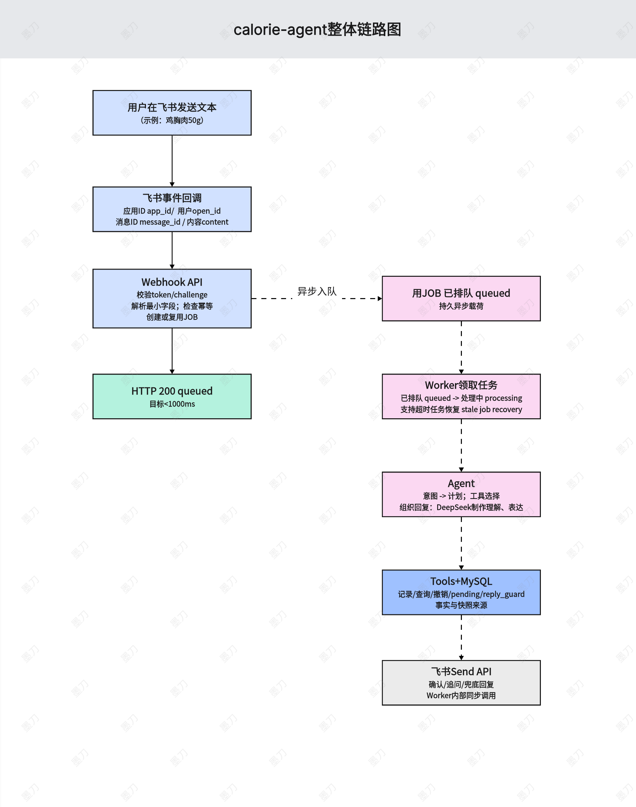

# Calorie Agent

把低摩擦饮食记录、可信 AI 工具调用和产品验证闭环放进飞书会话。

`Calorie Agent` 是一个面向飞书机器人的自然语言饮食记录 Agent。用户在飞书里输入“鸡胸肉 50g”“早餐鸡蛋100g，中午米饭200g，查下今天还剩多少”，系统会完成意图理解、工具执行、饮食记录、今日查询、撤销、缺失信息追问和结果回复。

它不是一个通用健康 App，也不是让大模型自由计算热量的聊天机器人。

它更像一套可验证的 AI Agent 产品链路：飞书负责低摩擦入口，AgentRuntime 负责规划和编排，后端工具与数据库负责事实读写，Reply Guard 和评测材料负责控制 AI 风险。

<p align="center">
  <strong>语言</strong>：
  <a href="./README.md">简体中文</a> |
  <a href="./README.en.md">English</a>
</p>

## 快速导航

- [简介](#简介)
- [为什么需要它](#为什么需要它)
- [适合谁](#适合谁)
- [它能做什么](#它能做什么)
- [效果示例](#效果示例)
- [核心能力](#核心能力)
- [和普通热量记录或 Chatbot 有什么不同](#和普通热量记录或-chatbot-有什么不同)
- [当前接入方式](#当前接入方式)
- [工作原理](#工作原理)
- [为什么可信](#为什么可信)
- [仓库结构](#仓库结构)
- [边界说明](#边界说明)
- [许可证](#许可证)

## 简介

这个 GitHub 文件夹是一个面向作品集展示和部署验证的发布包，而不是完整开发仓库快照。它保留了两套可运行的腾讯云函数代码包，以及 PRD、链路图、测试数据和指标看板材料。

当前发布包由三部分组成：

- `calorie-agent-apiV2/`：V2 云函数包，包含飞书入口、AgentRuntime、工具执行、Bitable 兼容路径、报告、提醒、记忆和 Reply Guard 等能力。
- `calorie-agent-apiV3-Beta-simulation/`：V3 Beta 模拟包，在 V2 能力基础上补充 MySQL storage、飞书多租户身份层和产品指标模块，并随包包含 PyMySQL 依赖。
- `PRD及测试数据、数据看板/`：产品文档、系统交互图、状态机、异常恢复图、测试集说明、灰度指标看板和 MySQL 灰度数据截图。

项目的核心目标不是“让模型回答饮食问题”，而是把高频饮食记录流程拆成可审查、可回放、可评测的产品链路。

## 为什么需要它

饮食记录产品的难点通常不是“功能能不能做”，而是用户是否愿意长期记录。

传统记录路径往往要求用户打开 App 或表单、搜索食物、估算克重、确认营养数据，再回到原来的工作流。对减脂、健身、控糖和日常健康管理用户来说，这个路径在高频场景里很容易中断。

`Calorie Agent` 选择把入口放进飞书会话，解决几个具体问题：

- 用户可以直接用自然语言记录，不需要切换到独立 App。
- 复合消息可以被拆成多个工具动作，例如先记录多餐，再查询今日剩余。
- 缺克重、食物歧义和未知食物不会被模型硬猜，而是进入 pending 追问。
- 飞书重试、云函数超时和重复消息通过幂等机制控制。
- 营养数值来自食物库、摄入快照和后端计算，不来自模型自由生成。
- 产品是否值得继续投入，可以通过 usage、feedback、retention 和 eval 指标判断。

## 适合谁

这个项目适合：

- 想验证低摩擦饮食记录场景的 AI 产品经理或独立开发者。
- 想研究 AI Agent 工具调用、状态管理、异常闭环和评测体系的人。
- 想把聊天入口接到真实业务数据，而不是只做 Demo 对话的人。
- 需要理解飞书机器人、腾讯云函数、Bitable/MySQL 和 LLM 编排边界的人。

它不太适合：

- 需要拍照识别、商城社区、完整健康管理 App 或商业化控制台的场景。
- 需要医疗诊断、个性化治疗建议或严肃医学结论的场景。
- 希望让 LLM 直接计算营养值、直接写库或绕过工具层的实现方式。
- 不需要幂等、权限隔离、异常恢复和评测门禁的轻量聊天机器人。

## 它能做什么

当前发布包中可查看或可部署的能力包括：

| 能力 | 说明 | 关键材料 |
|---|---|---|
| 飞书文本入口 | 接收飞书机器人文本事件，快速返回 `status=accepted`，并在云函数内继续处理 | [V2 SCF 包](calorie-agent-apiV2/README.md), [V3 Beta 包](calorie-agent-apiV3-Beta-simulation/README.md) |
| 自然语言饮食记录 | 支持已知食物、多食物消息、复合消息和今日汇总 | [V2 源码包](calorie-agent-apiV2/calorie_agent/), [V3 源码包](calorie-agent-apiV3-Beta-simulation/calorie_agent/) |
| 查询与撤销 | 支持今日查询、摄入快照查询、撤销上一条或语义撤销 | [domain 模块](calorie-agent-apiV3-Beta-simulation/calorie_agent/domain/) |
| 缺失信息追问 | 缺克重、未知食物、低置信候选进入 pending 流程 | [pending.py](calorie-agent-apiV3-Beta-simulation/calorie_agent/domain/pending.py) |
| Agent 工具编排 | DeepSeek 产出 action plan，后端只执行白名单工具 | [agent 模块](calorie-agent-apiV3-Beta-simulation/calorie_agent/agent/) |
| 事实型回复校验 | Reply Guard 用 execution facts 校验最终回复，阻断编造数字和错误状态 | [reply_guard.py](calorie-agent-apiV3-Beta-simulation/calorie_agent/agent/reply_guard.py) |
| V3 MySQL 数据层 | V3 Beta 补充 MySQL schema、repository、连接层和幂等写入策略 | [schema.sql](calorie-agent-apiV3-Beta-simulation/calorie_agent/storage/schema.sql) |
| 飞书多租户身份层 | 从飞书事件解析 app/open_id/chat/message，映射为 tenant/user 上下文 | [identity 模块](calorie-agent-apiV3-Beta-simulation/calorie_agent/identity/) |
| 产品指标闭环 | usage、feedback、activation、retention 和灰度看板材料 | [product_metrics 模块](calorie-agent-apiV3-Beta-simulation/calorie_agent/product_metrics/), [指标看板](PRD及测试数据、数据看板/v3灰度测试指标看板.docx) |
| PRD 与图表 | 包含整体链路图、时序图、状态机图和异常恢复图 | [PRD 目录](PRD及测试数据、数据看板/PRD/) |

## 效果示例

用户输入：

> 早餐鸡蛋100g，中午米饭200g鸡胸肉150g，查下今天还剩多少

系统不应该直接让模型“算一个答案”，而是按可审查链路处理：

1. 飞书事件进入 `/webhook/feishu/events`。
2. Webhook 校验、解析、幂等处理，并快速返回 `status=accepted`。
3. AgentRuntime 让 DeepSeek 生成结构化 action plan。
4. Tool Executor 顺序执行多个 `record_food` 动作，再执行 `query_today`。
5. 食物匹配、克重、kcal、carbs、protein、fat 来自工具和数据表。
6. Reply Guard 检查最终回复，数字必须能追溯到 execution facts。
7. 飞书会话内返回自然语言结果。
8. metrics、diagnostics 和可选 trace 记录本次链路。

核心图表：

| 图表 | 链接 |
|---|---|
| 整体链路图 | [calorie-agent整体链路图.png](PRD及测试数据、数据看板/PRD/calorie-agent整体链路图.png) |
| 异步处理时序图 | [时序图.png](PRD及测试数据、数据看板/PRD/时序图.png) |
| Job 状态机 | [状态机图.png](PRD及测试数据、数据看板/PRD/状态机图%20%281%29.png) |
| 异常与恢复总览 | [06_exception_recovery.png](PRD及测试数据、数据看板/PRD/06_exception_recovery.png) |
| V3 Beta PRD | [飞书饮食记录Agent_V3_Beta_PRD.docx](PRD及测试数据、数据看板/PRD/飞书饮食记录Agent_V3_Beta_PRD.docx) |



## 核心能力

`Calorie Agent` 的核心不是把回复写得更像人，而是把 AI Agent 的关键风险显式控制住。

- **低摩擦入口**：用户在飞书里用自然语言完成记录、查询、撤销和追问补全。
- **工具边界**：LLM 只负责理解、规划和表达，不直接写库、不直接查询、不计算营养事实。
- **幂等写入**：用 `message_id`、`idempotency_key` 和 per-action key 防止飞书重试导致重复摄入。
- **缺失信息闭环**：缺克重、未知食物、歧义候选进入 pending，而不是让模型猜。
- **软删除撤销**：撤销把摄入记录标记为 `deleted`，今日汇总排除该记录，同时保留审计空间。
- **多用户隔离**：V3 使用 `tenant_id + user_id` 作为数据边界，同一飞书 open_id 在不同 app 下隔离。
- **事实型回复**：Reply Guard 阻断编造数字、错误完成状态、权限泄露和医疗诊断类表达。
- **产品验证**：以激活、留存、有效反馈、失败用户数和指标事件判断下一步投入优先级。

## 和普通热量记录或 Chatbot 有什么不同

| 对比项 | 普通热量记录 App | 普通 Chatbot | Calorie Agent |
|---|---|---|---|
| 入口 | 打开 App 或表单 | 对话窗口 | 飞书会话内自然语言 |
| 数据来源 | 用户手填或 App 数据库 | 模型回答为主 | 工具层和数据库事实 |
| 多动作处理 | 通常需要多步操作 | 容易自由发挥 | action plan + 白名单工具 |
| 错误处理 | 多为表单校验 | 常缺少状态闭环 | pending、retry、dead letter、diagnostics |
| 重复消息 | 通常不是核心问题 | 很少处理 | 幂等 key 和 duplicate skip |
| 撤销 | UI 操作 | 语义不稳定 | 软删除 + 候选定位 + 权限边界 |
| AI 风险 | AI 参与较少 | 容易编造事实 | Reply Guard + execution facts |
| 验证方式 | 功能测试为主 | 对话样例为主 | PRD + 测试集 + 灰度数据 + 指标看板 |

## 当前接入方式

这个 GitHub 文件夹中的 `calorie-agent-apiV2/` 和 `calorie-agent-apiV3-Beta-simulation/` 是已经展开的腾讯云函数包。它们不是完整开发工程目录，因此不包含原开发仓库中的 `backend/tests`、`scripts/build_scf_zip.py` 或 `.env.example`。

### 1. 选择部署包

| 包 | 适合场景 | 说明 |
|---|---|---|
| [calorie-agent-apiV2](calorie-agent-apiV2/) | Bitable 兼容路径、AgentRuntime 能力展示 | 包含飞书入口、工具执行、报告、提醒、记忆、Reply Guard 和 V2 Runtime 相关模块 |
| [calorie-agent-apiV3-Beta-simulation](calorie-agent-apiV3-Beta-simulation/) | V3 Beta 模拟与 MySQL 方向展示 | 在 V2 基础上增加 `identity`、`storage`、`product_metrics`，并包含 PyMySQL 运行依赖 |

### 2. 配置腾讯云函数

腾讯云函数建议配置：

- Runtime：Python 3.10
- Function type：HTTP function / Web function
- Listen port：`9000`
- Bootstrap file：`scf_bootstrap`

核心入口：

```text
GET  /health
POST /webhook/feishu/events
POST /tasks/daily-cleanup?token=<ROLLOVER_TASK_TOKEN>
POST /tasks/reminders?token=<ROLLOVER_TASK_TOKEN>
```

必填变量包括：

```env
PORT=9000
FEISHU_APP_ID=
FEISHU_APP_SECRET=
FEISHU_VERIFICATION_TOKEN=
DEEPSEEK_API_KEY=
ROLLOVER_TASK_TOKEN=
BITABLE_APP_TOKEN=
BITABLE_FOOD_TABLE_ID=
BITABLE_INTAKE_TABLE_ID=
BITABLE_PENDING_TABLE_ID=
```

V3 Beta MySQL 相关变量见 [V3 schema.sql](calorie-agent-apiV3-Beta-simulation/calorie_agent/storage/schema.sql) 和 [mysql_client.py](calorie-agent-apiV3-Beta-simulation/calorie_agent/storage/mysql_client.py)。

### 3. 打包上传

如果从当前 GitHub 文件夹部署，需要把目标子目录内容作为 zip 根目录，而不是把外层目录一起压进去。

zip 根目录应直接包含：

```text
app.py
calorie_agent/
README.md
requirements.txt
scf_bootstrap
```

V3 Beta 包还包含：

```text
pymysql/
pymysql-1.2.0.dist-info/
```

`scf_bootstrap` 需要保持可执行权限；如果在 Windows 上重新压缩后权限丢失，应在云函数部署侧或构建脚本中修正。

## 工作原理

`Calorie Agent` 的核心原则是：**模型做规划，工具做事实，指标和评测做门禁。**

主流程可以理解为：

```text
Feishu message
  -> Webhook verification / parse / idempotency
  -> quick ACK
  -> AgentRuntime planner
  -> whitelisted tool execution
  -> storage read/write
  -> Reply Guard
  -> Feishu reply
  -> metrics / diagnostics / product feedback
```

### Agent 事实边界

- DeepSeek 不计算 `kcal`、`carbs`、`protein`、`fat`。
- DeepSeek 不直接写数据库、不直接执行查询、不直接撤销。
- 食物模糊匹配只能返回候选；低置信或多候选必须追问。
- 缺克重、缺营养字段必须进入 pending 或追问。
- 回复中的事实数字必须来自工具结果或摄入快照。

### V3 数据方向

V3 将 MySQL 作为主业务数据库方向，关键表在 [schema.sql](calorie-agent-apiV3-Beta-simulation/calorie_agent/storage/schema.sql) 中定义，包括：

- `tenants`
- `users`
- `foods`
- `food_aliases`
- `intake_records`
- `standards`
- `memories`
- `usage_events`
- `feedback_samples`

其中 `intake_records` 保存食物名、克重和营养快照，历史查询读取当时快照，不用当前食物库重新计算。

### 评测与数据材料

当前发布包不包含原开发仓库里的离线测试脚本，但包含了面向作品集展示和复盘的测试与指标材料：

- [测试集与数据指标.docx](PRD及测试数据、数据看板/测试集与数据指标.docx)
- [v3灰度测试指标看板.docx](PRD及测试数据、数据看板/v3灰度测试指标看板.docx)
- [灰度测试数据 MYSQL 截图](PRD及测试数据、数据看板/灰度测试数据/MYSQL/)

这些材料应按“灰度前高保真模拟评测 / 数据看板样例”理解，除非另有真实用户数据来源说明。

## 为什么可信

这个项目的可信度主要来自仓库内可阅读、可运行、可复核的材料，而不是口头描述。

| 文件或目录 | 说明 |
|---|---|
| [calorie-agent-apiV2/README.md](calorie-agent-apiV2/README.md) | V2 腾讯云函数包部署、环境变量、飞书配置、日志排查 |
| [calorie-agent-apiV2/calorie_agent/agent/](calorie-agent-apiV2/calorie_agent/agent/) | V2 AgentRuntime、planner、tool executor、reply guard 等核心模块 |
| [calorie-agent-apiV3-Beta-simulation/README.md](calorie-agent-apiV3-Beta-simulation/README.md) | V3 Beta 模拟包说明 |
| [calorie-agent-apiV3-Beta-simulation/calorie_agent/storage/schema.sql](calorie-agent-apiV3-Beta-simulation/calorie_agent/storage/schema.sql) | V3 MySQL 数据层、幂等策略和隔离表结构 |
| [calorie-agent-apiV3-Beta-simulation/calorie_agent/identity/](calorie-agent-apiV3-Beta-simulation/calorie_agent/identity/) | 飞书多租户身份解析和 UserContext |
| [calorie-agent-apiV3-Beta-simulation/calorie_agent/product_metrics/](calorie-agent-apiV3-Beta-simulation/calorie_agent/product_metrics/) | usage、feedback、activation、retention 指标模块 |
| [PRD及测试数据、数据看板/PRD/飞书饮食记录Agent_V3_Beta_PRD.docx](PRD及测试数据、数据看板/PRD/飞书饮食记录Agent_V3_Beta_PRD.docx) | V3 Beta PRD |
| [PRD及测试数据、数据看板/测试集与数据指标.docx](PRD及测试数据、数据看板/测试集与数据指标.docx) | 测试集与指标口径材料 |
| [PRD及测试数据、数据看板/v3灰度测试指标看板.docx](PRD及测试数据、数据看板/v3灰度测试指标看板.docx) | V3 灰度指标看板材料 |

## 仓库结构

当前 GitHub 项目文件夹真实结构如下：

```text
.
├── README.md
├── README.en.md
├── calorie-agent-apiV2/
│   ├── README.md
│   ├── app.py
│   ├── requirements.txt
│   ├── scf_bootstrap
│   └── calorie_agent/
│       ├── agent/
│       ├── context/
│       ├── domain/
│       ├── memory/
│       ├── skills/
│       ├── tools/
│       ├── legacy_app.py
│       └── __init__.py
├── calorie-agent-apiV3-Beta-simulation/
│   ├── README.md
│   ├── app.py
│   ├── requirements.txt
│   ├── scf_bootstrap
│   ├── pymysql/
│   ├── pymysql-1.2.0.dist-info/
│   └── calorie_agent/
│       ├── agent/
│       ├── context/
│       ├── domain/
│       ├── identity/
│       ├── memory/
│       ├── product_metrics/
│       ├── skills/
│       ├── storage/
│       ├── tools/
│       ├── legacy_app.py
│       └── __init__.py
└── PRD及测试数据、数据看板/
    ├── PRD/
    │   ├── 飞书饮食记录Agent_V3_Beta_PRD.docx
    │   ├── calorie-agent整体链路图.png
    │   ├── 时序图.png
    │   ├── 状态机图 (1).png
    │   └── 06_exception_recovery.png
    ├── 灰度测试数据/
    │   └── MYSQL/
    ├── 测试集与数据指标.docx
    └── v3灰度测试指标看板.docx
```

关键目录说明：

- `calorie-agent-apiV2/calorie_agent/agent/`：AgentRuntime、planner、tool executor、reply guard、V2 runtime 等模块。
- `calorie-agent-apiV2/calorie_agent/domain/`：撤销、pending、报告、提醒、异常、食物匹配等业务逻辑。
- `calorie-agent-apiV2/calorie_agent/skills/`：用于 planner 的 markdown skill 描述。
- `calorie-agent-apiV3-Beta-simulation/calorie_agent/storage/`：MySQL schema、repository 和连接层。
- `calorie-agent-apiV3-Beta-simulation/calorie_agent/identity/`：飞书身份解析、tenant/user 上下文。
- `calorie-agent-apiV3-Beta-simulation/calorie_agent/product_metrics/`：usage、feedback、retention 指标模块。
- `PRD及测试数据、数据看板/`：产品设计、系统图、测试集、灰度指标和 MySQL 数据截图材料。

## 边界说明

当前项目更适合作为 AI Agent 产品验证与后端链路作品集，而不是完整商业化应用。

已知边界：

- 当前主入口是飞书机器人，不是独立 App 或通用健康平台。
- 当前 GitHub 文件夹是发布包与文档材料，不是完整开发仓库；离线测试脚本和构建脚本未包含在此发布包中。
- V3 MySQL 是主业务数据库方向，但 V2/Bitable 兼容路径仍保留。
- V2/V3 的部分能力采用 feature flag、shadow、read-only 或 opt-in 策略，不应默认理解为全部生产接管。
- 项目不做拍照识别、商城社区、完整控制台、教练端和复杂商业化权限体系。
- 项目不提供医疗诊断或治疗建议，所有营养信息应被视为记录和管理辅助。
- 材料中的灰度/评测数据应按“高保真模拟评测或灰度前验证材料”理解，除非另有真实用户数据来源说明。

如果你的目标只是一次性聊天问答，直接做一个轻量 Bot 可能更简单。这个项目的价值在于把 Agent 主链路、数据边界、异常恢复和评测闭环一起设计出来。

## 许可证

当前仓库根目录尚未声明开源许可证。公开分发、商用复用或二次发布前，请先补充明确的 `LICENSE` 文件。
